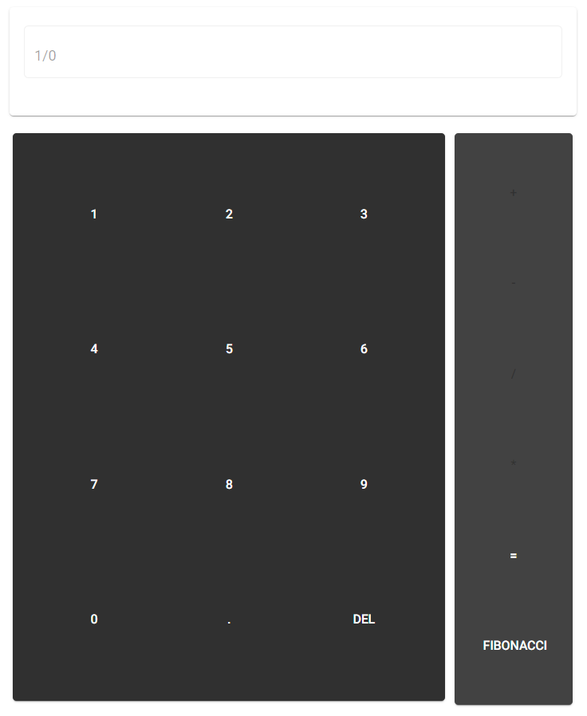

# Minimal Material Calculator (RESTful)

This is a Minimal RESTful Calculator implemented whit Core backend using Spring Boot REST APIs & Frontend using Angular (https://angular.io/) / Angular Material design (https://material.angular.io).



### Technology Stack
Component         | Technology
---               | ---
Frontend          | [Angular 7](https://angular.io/)
Backend (REST)    | [SpringBoot](https://projects.spring.io/spring-boot) (Java)
REST Documentation| [Swagger UI](https://swagger.io/tools/swagger-ui/)
REST Spec         | [Open API Standard](https://www.openapis.org/) 
Client Build Tools| [angular-cli](https://github.com/angular/angular-cli), Webpack, npm
Server Build Tools| Maven(Java)

### Spring Boot
Spring framework is an open source Java platform that provides comprehensive infrastructure support for developing robust Java applications very easily and very rapidly.

### Swagger UI
Swagger UI is used to document and test the REST API from browser. The console can be accessed from this address (http://localhost:8080/swagger-ui.html) 


### REST API
REST (REpresentational State Transfer) is an architectural style, and an approach to communications that is often used in the development of Web services. Modern-Ecommerce core backend support fully REST API to allow integarte with any Frontend platform

## Getting Started

To install this example application, run the following commands:

```bash
git clone https://dadevops.ddns.net/firm2020/restful-calculator.git
cd restful-calculator
```

This will get a copy of the project installed locally. To install all of its dependencies and start each app, follow the instructions below.

To run the backend, cd into thec folder and run:
 
```bash
./mvnw spring-boot:run
```

To run the client, cd into the `rest-calculator-angular` folder and run:
 
```bash
npm install && npm start
```
### Note

In the `deploy/backend` folder there is a ready war file that can be deployable in any Java application server; the client application can be found in the folder `deploy/frontend` and can be deployable in any HTTP server.

### Accessing Application
Component         | URL                                      
---               | ---                                      
Frontend          |  http://localhost:4200                   
Swagger (API Ref) |  http://localhost:8080/swagger-ui.html

